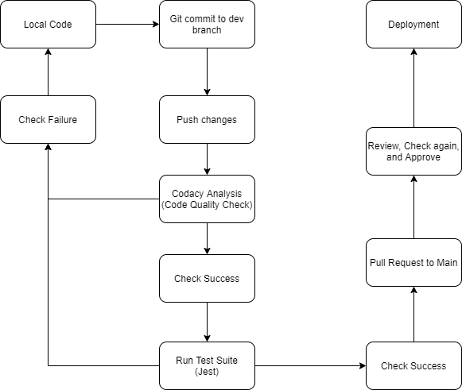

# Group 13 CI/CD Pipeline Phase 1

## Jest
Currently we have testing set up in a similar fashion to Lab 8, utilzing the framework Jest and simply automating the process using GitHub actions. All of the necessary dependencies are in package.json files and all of the tests we will be writing will be located in the __tests_\_ directory. Every time code is pushed to any of our branches, the test suite will run through GitHub actions and will notify us when something goes wrong. If necessary, the test suite can also be run locally on the terminal or manually through the repository under actions. Currently, we have a sample test to ensure that the pipeline is functioning properly and more tests are to be incorpated such as end to end tests and unit tests.
## Codacy Analysis CLI 
Currently, we are exploring utilizing Codacy as a code quality checker. It runs via GitHub Actions and analyzes every push to check for code quality and for any issues that may be found within our code. The workflow will automatically fail if it detects any issue.
## Pull Requests
After pushing code to the dev branch and the code successfully passes the workflow checks, a pull request can be setup for review and to allow for merging to main.
## Works in Progress
- Adding more testing 
  - Additional Frameworks? (Cypress, Postman)
  - Unit Testing
  - End-to-end testing
- Linting
- Documentation Generation
  - JSDocs
