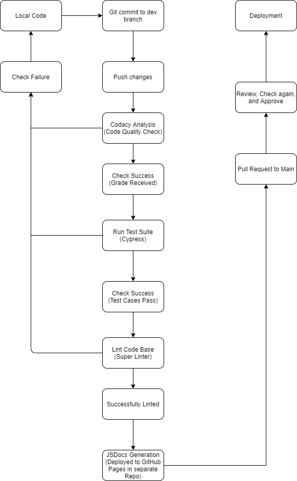

# Group 13 CI/CD Pipeline Phase 2

## Cypress
We ran into a big blocker as there was an issue with Jest timing out our test suite everytime we ran it as a result of a popup that our app displayed. After being stuck on the issue for a while, we decided to transition over to a new framework, Cypress and we have gotten it to function properly and all of its necessary tests and components are located in the cypress folder of our repo. As part of our pipeline, Cypress will run automatically whenever something is pushed to main or during a pull request. We are also working on expanding the testing using Cypress to properly test the functionality of our app. 
## Codacy Analysis CLI 
We have been utilizing Codacy as a code quality checker. It runs via GitHub Actions and analyzes every push to check for code quality and for any issues that may be found within our code. The workflow will automatically fail if it detects any issue. We have also added the Codacy badge in our README that displays the grade that Codacy gave our code. Intially, Codacy only gave our code a B, but after examining Codacy's analysis and making some changes we were able to get that code quality grade bumped up to an A. 
## Linting
We are utilizing Super Linter within GitHub actions as the linter for our code base. It automates the linting process whenever code is pushed to main. A badge is displayed on our README that shows whether or not it is passing the lint check. We also implemented our own linting configuration that enforces semicolon usage as Super Linter defaulted to not requiring semicolons and threw an error about the added semicolons.
## JSDoc Generation
We are utilizing the JSDoc GitHub Action to automate the generation of our documentation for our javascript files. The workflow automatically creates the documentation and pushes it to a separate repo to store the documentation and host it on GitHub pages.
## Pull Requests
After pushing code to the dev branch and the code successfully passes the workflow checks, a pull request can be setup for a team member to review and to allow for merging to main.
## Work in Progress
- Adding more testing using Cypress to ensure everything works properly as we near the end of the project

