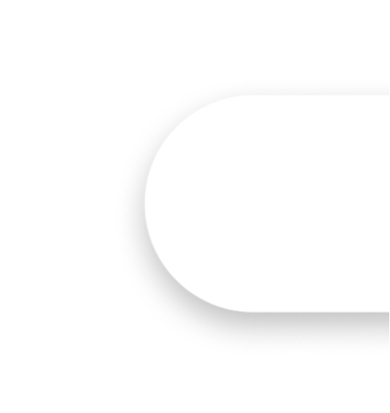
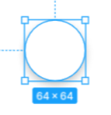

# Design Document

[TOC]

## Overview and Global Variables

This section specifies some shared designs across the whole application. The follow global variables should be declared to convenient maintenance. 

```css
/* colors */
--white: #ffffff;
--black: ?

/* components */
--circular-corner: 9999px;
--button-height: 64px;
--button-width: 64px;
--shadow: 0 4px 10px rgba(0, 0, 0, 0.25);
--shadow-hover: 0 8px 20px rgba(0, 0, 0, 0.25);
```


1. Borders

   If a component appears like a card, it must have a corner radius. The value may be different for each component. If the entire side appears like a semi-circle, set the corner radius to `border-radius: var(--circular-corner)`. 

   

   Border style should be set to `none` unless otherwise specified.

   ==TODO: Smaller border radius==

   

2. Buttons

   Buttons should use the follow style unless specified otherwise.

   ```css
   .button {
       background-color: white;
       height: var(--button-height);
       width: var(--button-width);
       border: none;
       border-radius: var(--circular-corner);
       box-shadow: var(--shadow);
   }
   ```

     <center></center>

3. Shadows

   If an element has shadow, use the following shadow style unless otherwise specified

   ```css
   box-shadow: var(--shadow);
   ```

4. Colors

   ?

5. Fonts

   ?

6. Tags

   ?

7. Search bar

   - Normal
     - `1px` border
   - Hover
     - no border, filled with color
   - Focus
     - 

8. Icons (Material icons):

   - Trash: `delete`
   - Favorite: `favorite, favorite_border`
   - Search: `search`
   - Filter: `filter_alt`
   - Add: `add`
   - Play: `play_arrow`
   - Pause: `pause`
   - Text-to-speech: `volume_up`
   - Arrow back: `arrow_back`
   - Done: `done`
   - Edit: `edit`
   - Create manually: `restaurant_menu`
   - Import from URL: `input`

## Home Page (My Recipes)

Components:

1. Search bar

   The search bar will search tags / keywords in the user's own recipes. See [Overview](#Overview) for details. 

2. Filter button

3. Clear filter button:

   When a filter is applied, a clear filter button should show up next to the filter button. It will disappear when no filter is selected. 

4. Tags:

   Tags will go under the search bar when selected. There will be 5 recent tags showing under the search bar as well. 

5. Recipe cards

   - **Size: ** `260 x 420` ==?==
   - **Boarder radius: ** `16px`
   - 

   - **Layout:** 
     - Maximum number of cards in each row: 4
     - Cards in each row should be aligned to the center of the screen
     - Margin between each card should be `64px`

6. Delete button

7. Add button


## Explore


## Favorites


## Navigation Bar

- Text instead of icons
- Selected Tab boarder radius: `9px`
- Order: `My Recipes | Favorites | Explore`


## Cooking Mode:

- Timer: Clone the [Google Timer](https://www.google.com/search?client=firefox-b-1-d&q=google+timer)

